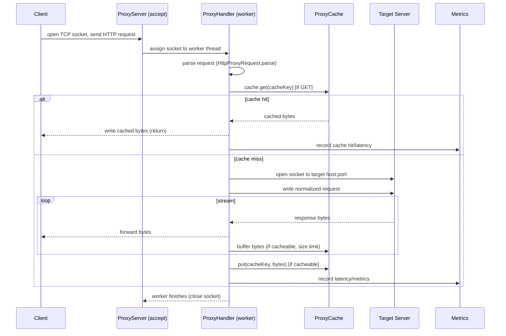
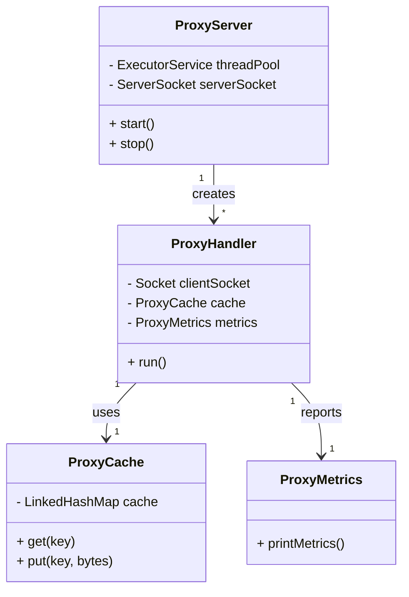

# Proxy Server - Data Flow & Enhancements

Below are UML-style data-flow diagrams (Mermaid) describing how the proxy in this project processes requests, followed by concise enhancement suggestions for production readiness and enterprise deployments.

## Flowchart (high-level data flow)

```mermaid
flowchart LR
  Client[Client]
  Proxy[ProxyServer]
  Handler[ProxyHandler (thread pool)]
  Cache[ProxyCache (LRU)]
  Target[Origin Server]
  Metrics[ProxyMetrics - Monitoring]

  Client -->|TCP connection| Proxy
  Proxy -->|assigns socket to| Handler
  Handler -->|parse request| Handler
  Handler -->|check GET cacheKey| Cache
  Cache -- HIT --> Handler
  Cache -- MISS --> Target
  Handler -->|stream response| Client
  Handler -->|store response (if cacheable)| Cache
  Handler -->|emit metrics| Metrics

  subgraph Concurrency
    Handler -.->|threadPool| Handler
  end

  style Proxy fill:#f9f,stroke:#333,stroke-width:1px
  style Cache fill:#fffbcc,stroke:#333
  style Metrics fill:#ccf,stroke:#333
```

## Sequence Diagram (detailed request lifecycle)



## Mermaid Class-like Overview (components)



## Enhancement Suggestions (short, actionable)

- **Middleware / Pluggable Filters**: add a small middleware pipeline inside `ProxyHandler` for cross-cutting concerns (auth, logging, request/response transforms). Make it configurable with a simple `Filter` interface.

- **Rate Limiting**: move rate limiting to a shared component (per-client or per-API key) — reuse `webserver.RateLimiter` style token-bucket. Consider enforcement at TCP accept (early drop) and in-handler checks for finer control.

- **Load Balancer & HA**: run multiple proxy instances behind an L4 (or L7) load balancer (Nginx, HAProxy, cloud LB). Persist cache with a distributed cache (Redis or Memcached) or use local cache + Cache-Control/TTL for correctness.

- **TLS Termination & Security**: terminate TLS at an edge (LB) or within the proxy (implement `SSLSocket` handling) and validate certificates for upstream connections where required. Add WAF rules for common attacks.

- **Circuit Breaker & Retry**: wrap upstream calls with circuit-breaker + bounded retries with exponential backoff. Protect origin servers and improve resilience.

- **Observability & Metrics**: export Prometheus metrics (counters/histograms) and structured logging (JSON). Add distributed traces (OpenTelemetry) for request correlation.

- **Autoscaling & Containerization**: containerize the proxy, use readiness/liveness probes, and autoscale based on CPU/latency metrics. Use shared service discovery for origin backends.

- **Advanced Enterprise Architecture**:
  - API Gateway in front for auth, API keys, rate-limiting, and routing.
  - Edge CDN + regional proxies for caching and low-latency delivery.
  - Service Mesh (Istio/Linkerd) for mTLS, telemetry, and fine-grained traffic control between internal services.
  - Centralized config & feature flags (LaunchDarkly, Consul) for dynamic tuning of limits, cache TTLs, routing rules.

- **Performance & Safety**:
  - Use non-blocking I/O (NIO / Netty) for higher concurrency where needed.
  - Harden thread-pool and queue policies: circuit-break on rejected tasks, backpressure to clients.
  - Implement streaming backpressure and bounded buffering to avoid OOM on large responses.

## Quick next steps I can take

- Generate a simplified sequence + deployment diagram for enterprise topology.
- Prototype adding a `Filter` interface and a pluggable `RateLimiter` hook in `ProxyHandler`.

---
Generated from code in server/java; ask me to generate the deployment diagram or scaffold a `Filter` interface next.
