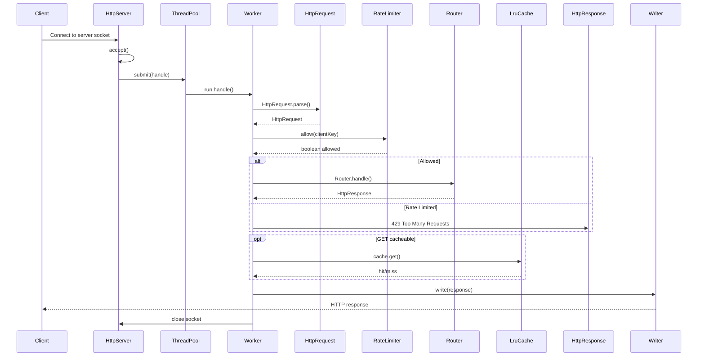
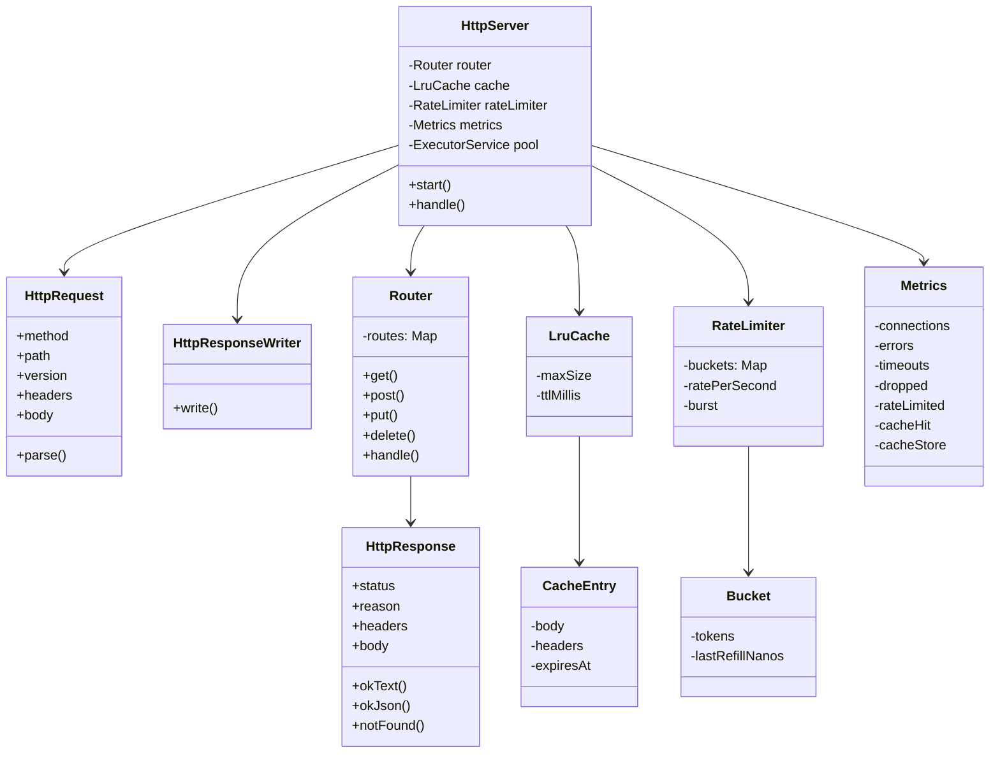

---

# ✅ FINAL README.md 
```markdown
```
# Java Multithreaded Web Server
```
A lightweight multithreaded HTTP server written entirely in Java.  
It includes a custom HTTP parser, routing system, LRU cache, rate limiter, metrics, and multithreaded request handling.
```
## 🚀 Features

```
- Custom HTTP/1.1 request parsing  
- Multithreaded request handling via thread pool  
- Simple router (GET, POST, PUT, DELETE)  
- LRU response cache with TTL  
- Token-bucket rate limiter per IP  
- Internal metrics tracking  
- Clean, modular architecture  

```

## 📦 Project Structure

```
src/main/java/com/example/webserver
│
├── HttpServer.java
├── HttpRequest.java
├── HttpResponse.java
├── HttpResponseWriter.java
├── Router.java
├── LruCache.java
├── CacheEntry.java
├── RateLimiter.java
├── Metrics.java
└── Main.java
```

---

## ▶️ Running the Server

Build:

```bash
mvn clean package
````

Run (default port 8080):

```bash
java -jar target/webserver.jar
```

Run on custom port:

```bash
java -jar target/webserver.jar 9090
```

---

## 🌐 Example Routes

| Method | Path       | Description              |
| ------ | ---------- | ------------------------ |
| GET    | `/`        | Welcome message          |
| GET    | `/healthz` | Health check             |
| GET    | `/time`    | Returns epochMillis JSON |
| POST   | `/echo`    | Echoes request body      |

---

# 📘 UML Sequence Diagram



---

# 📚 ER Diagram



## ✍️ Author

Built for learning and exploring Java networking, concurrency, caching, and HTTP internals.

