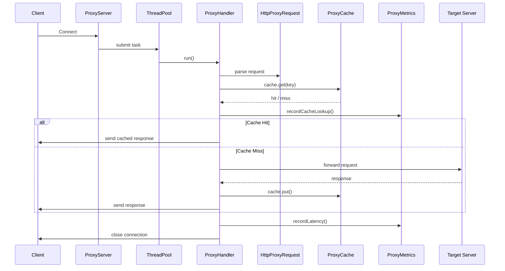
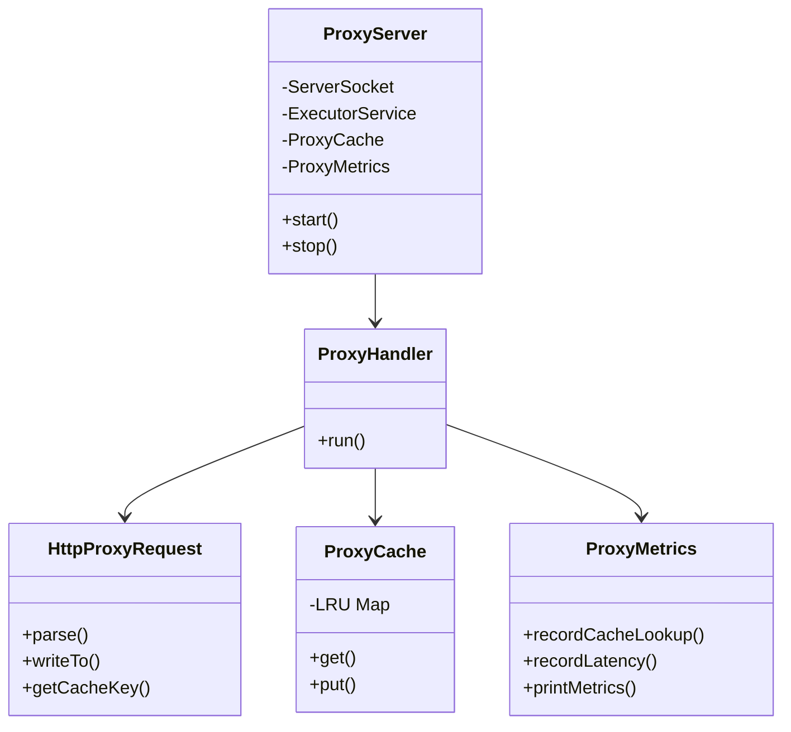

# 🚀 Java Multithreaded HTTP Proxy Server

```
A high-performance multithreaded HTTP proxy server written entirely in Java.
Built from scratch to understand low-level networking, concurrency, HTTP internals,
caching strategies, and real-world server metrics.
```

This project is **framework-free** (no Spring, no Netty) and focuses on **core Java + sockets**.

---

## ✨ Key Features

```
- Pure Java socket-based HTTP proxy
- Multithreaded request handling using ExecutorService
- Fixed-size thread pool with backpressure (CallerRunsPolicy)
- Thread-safe LRU cache with TTL
- Response-size–aware caching (only cache small responses)
- Per-request latency tracking
- Cache hit / miss tracking
- Graceful shutdown with final metrics snapshot
- Clean, modular, interview-ready architecture
```

---

## 📦 Project Structure

```
server/java/
├── src/com/example/proxy/
│   ├── ProxyServer.java        # Server bootstrap, thread pool, lifecycle
│   ├── ProxyHandler.java       # Per-connection request handling
│   ├── HttpProxyRequest.java   # HTTP request parsing & forwarding
│   ├── ProxyCache.java         # Thread-safe LRU cache with TTL
│   └── ProxyMetrics.java       # Metrics collection & reporting
├── out/                         # Compiled classes
├── README.md
└── BEGINNER_SETUP_GUIDE.md
```

---

## ▶️ Running the Server (Terminal)

### 1️⃣ Compile

```bash
cd server/java
javac -d out src/com/example/proxy/*.java
```

### 2️⃣ Run (default config)

```bash
java -cp out com.example.proxy.ProxyServer 10000
```

Arguments:

```
ProxyServer <port> <threadPoolSize> <cacheSize>
```

Example:

```bash
java -cp out com.example.proxy.ProxyServer 10000 100 1000
```

---

## 🌐 Testing the Proxy

### Basic test

```bash
curl -x http://127.0.0.1:10000 http://example.com
```

### Cache behavior test

```bash
# First request → cache MISS
curl -x http://127.0.0.1:10000 http://example.com

# Repeated requests → cache HIT
curl -x http://127.0.0.1:10000 http://example.com
curl -x http://127.0.0.1:10000 http://example.com
```

---

## 📊 Metrics (Printed on Shutdown)

When you press **Ctrl + C**, the server prints a complete metrics snapshot:

```
=== PROXY SERVER METRICS ===
Connections Received : 30
Requests             : 30
Cache Lookups        : 30
Cache Hits           : 20
Cache Misses         : 10
Cache Hit Rate       : 66.67%
Bad Requests         : 0
Errors               : 0
Timeouts             : 0
Average Latency      : 12 ms
```

📌 This design mirrors **real production servers**, where metrics are aggregated and flushed on shutdown.

---

## 🧠 Internal Architecture (High Level)

```
Client
  ↓
ProxyServer (accept socket)
  ↓
ExecutorService (thread pool)
  ↓
ProxyHandler
  ├── HttpProxyRequest.parse()
  ├── Cache lookup (hit / miss)
  ├── Forward request to target server
  ├── Stream response back to client
  └── Store response in cache (if cacheable)
```

---

## 📘 UML Sequence Diagram



---

## 📊 ER / Class Diagram



---

## 🎥 Demo Video

📺 **Project Walkthrough & Live Demo**
👉 *Add your video link here*:

```
[Video](https://youtu.be/5PMmvyknhLw)
```

*(Recommended content for video)*:

* Cache hit vs miss demo
* Metrics output on Ctrl + C
* Thread pool behavior under load

---

## 🎯 What This Project Demonstrates (Interview Ready)

* Low-level Java socket programming
* Thread pool design & backpressure handling
* LRU caching with TTL
* HTTP proxy request forwarding
* Metrics aggregation (hits, misses, latency)
* Graceful shutdown handling
* Production-style logging & monitoring mindset

---

## ✍️ Author

Built for deep learning of **Java networking, concurrency, HTTP internals, and system design fundamentals**.

---
